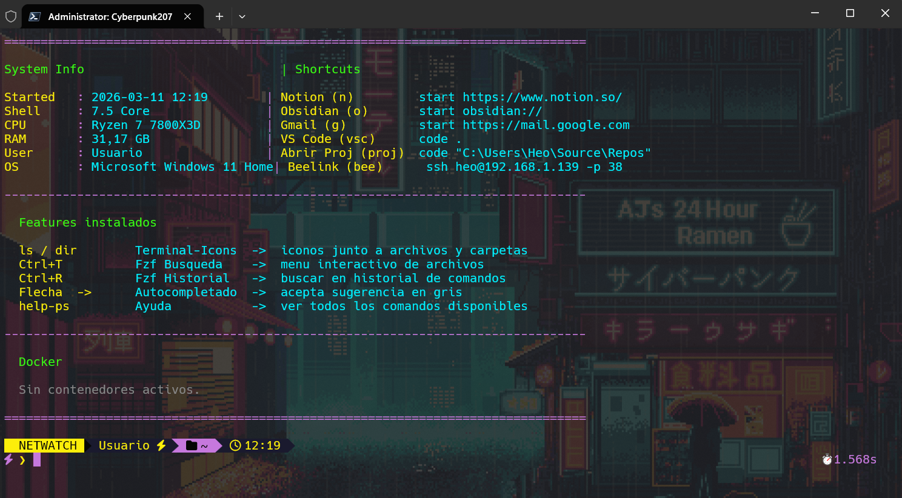

<div align="center">

<div align="center">
  
</div>

<pre>
 ██████╗██╗   ██╗██████╗ ███████╗██████╗ 
██╔════╝╚██╗ ██╔╝██╔══██╗██╔════╝██╔══██╗
██║      ╚████╔╝ ██████╔╝█████╗  ██████╔╝
██║       ╚██╔╝  ██╔══██╗██╔══╝  ██╔══██╗
╚██████╗   ██║   ██████╔╝███████╗██║  ██║
 ╚═════╝   ╚═╝   ╚═════╝ ╚══════╝╚═╝  ╚═╝
   P O W E R S H E L L  ·  N E T W A T C H
</pre>


**Cyberpunk-themed PowerShell environment for Windows**

*Dashboard · Oh My Posh NETWATCH theme · Multi-theme switcher · Docker status · SSH shortcut*

**🌍 [English](#-english-version) · 🇪🇸 [Español](#-versión-en-español)**

</div>

---

## 📸 Preview

<div align="center">



</div>

---

## 🇪🇸 Versión en Español

### ✨ Qué incluye

- **Dashboard al arranque** — System Info · Shortcuts · Features instalados · Docker status en tiempo real
- **Tema Oh My Posh `NETWATCH`** — prompt con rama git, ruta, usuario y tiempo de ejecución
- **Paleta de colores global** — cambia todo el tema editando 6 variables hex
- **Sistema de temas** — `Set-Theme cyberpunk` o `Set-Theme default` en caliente
- **`Write-Cyber`** — helper ANSI para escribir con cualquier color hex en PowerShell
- **Comando `bee`** — conexión SSH inteligente con detección online/offline
- **`help-ps`** — ayuda completa con herramientas, atajos y funciones
- **Instalador automático** — `install.ps1` configura todo desde cero

---

### 🚀 Instalación rápida

```powershell
# 1. Clona el repo
git clone https://github.com/HEO-80/powershell-cyberpunk.git
cd powershell-cyberpunk

# 2. Ejecuta el instalador (requiere permisos de administrador)
.\install.ps1

# 3. Reinicia PowerShell
```

El instalador instala automáticamente: Oh My Posh · Terminal-Icons · PSReadLine · z · PSFzf · fzf

---

### ⚙️ Instalación manual

Si prefieres instalar manualmente, añade esta línea a tu `$PROFILE`:

```powershell
. "C:\ruta\a\powershell-cyberpunk\profile.ps1"
```

---

### 🎨 Cambiar colores

Edita la paleta en `themes/Cyberpunk2077.ps1`:

```powershell
$global:CY = @{
    Yellow  = "#FCEE0A"   # Acento principal — amarillo NETWATCH
    Green   = "#39FF14"   # Éxito / git limpio
    Cyan    = "#00F0FF"   # Info / valores
    Magenta = "#C678DD"   # Separadores / secundario
    Dark    = "#555555"   # Bordes
    Dim     = "#888888"   # Texto atenuado
}
```

---

### 🖥️ Cambiar tema en caliente

```powershell
Set-Theme cyberpunk   # tema NETWATCH completo con dashboard
Set-Theme default     # tema limpio sin dashboard
```

O establece el tema por defecto via variable de entorno en Windows Terminal:
```json
"environmentVariables": { "CYBER_THEME": "default" }
```

---

### 🔌 Configurar SSH (comando `bee`)

Añade estas variables de entorno en Windows Terminal o en tu sistema:

```json
"environmentVariables": {
    "CYBER_SSH_HOST": "192.168.1.x",
    "CYBER_SSH_USER": "tu-usuario",
    "CYBER_SSH_PORT": "22"
}
```

Luego ejecuta `bee` en la terminal para conectar.

---

### 🗂️ Estructura

```
powershell-cyberpunk/
├── themes/
│   ├── Cyberpunk2077.ps1   ← tema principal con dashboard
│   └── omp_cyberpunk.json  ← tema Oh My Posh NETWATCH
├── profile.ps1             ← orquestador con Set-Theme
├── install.ps1             ← instalador automático
└── README.md
```

---

### 🗺️ Roadmap

- [x] Dashboard con System Info + Docker status
- [x] Tema Oh My Posh NETWATCH
- [x] Paleta de colores configurable
- [x] Sistema de temas intercambiables
- [x] Helper `Write-Cyber` para colores ANSI hex
- [x] Instalador automático
- [ ] Tema para Linux/WSL (Fish + Bash)
- [ ] Soporte para Nerd Fonts automático
- [ ] Módulo de Git stats en el dashboard
- [ ] Integración con Starship como alternativa a Oh My Posh

---

### 🧑‍💻 Autor

**Héctor Oviedo** — Full Stack Dev & DeFi Researcher

[](https://www.linkedin.com/in/hectorob/)
[](https://github.com/HEO-80)
[](https://portfolio-cyberpunk-phi.vercel.app)

---
---

## 🇬🇧 English Version

### ✨ What's included

- **Startup dashboard** — System Info · Shortcuts · Installed features · Live Docker status
- **Oh My Posh `NETWATCH` theme** — prompt with git branch, path, user and execution time
- **Global color palette** — change the entire theme by editing 6 hex variables
- **Theme switcher** — `Set-Theme cyberpunk` or `Set-Theme default` at runtime
- **`Write-Cyber`** — ANSI helper to write any hex color in PowerShell
- **`bee` command** — smart SSH with online/offline host detection
- **`help-ps`** — full help with tools, shortcuts and functions
- **Auto installer** — `install.ps1` sets everything up from scratch

---

### 🚀 Quick install

```powershell
# 1. Clone the repo
git clone https://github.com/HEO-80/powershell-cyberpunk.git
cd powershell-cyberpunk

# 2. Run the installer (requires admin privileges)
.\install.ps1

# 3. Restart PowerShell
```

The installer automatically sets up: Oh My Posh · Terminal-Icons · PSReadLine · z · PSFzf · fzf

---

### ⚙️ Manual install

If you prefer manual setup, add this line to your `$PROFILE`:

```powershell
. "C:\path\to\powershell-cyberpunk\profile.ps1"
```

---

### 🎨 Changing colors

Edit the palette in `themes/Cyberpunk2077.ps1`:

```powershell
$global:CY = @{
    Yellow  = "#FCEE0A"   # Main accent — NETWATCH yellow
    Green   = "#39FF14"   # Success / clean git
    Cyan    = "#00F0FF"   # Info / values
    Magenta = "#C678DD"   # Separators / secondary
    Dark    = "#555555"   # Borders
    Dim     = "#888888"   # Muted text
}
```

---

### 🖥️ Switching themes at runtime

```powershell
Set-Theme cyberpunk   # full NETWATCH theme with dashboard
Set-Theme default     # clean theme without dashboard
```

Or set the default theme via environment variable in Windows Terminal:
```json
"environmentVariables": { "CYBER_THEME": "default" }
```

---

### 🔌 SSH shortcut (`bee` command)

Add these environment variables in Windows Terminal or system settings:

```json
"environmentVariables": {
    "CYBER_SSH_HOST": "192.168.1.x",
    "CYBER_SSH_USER": "your-username",
    "CYBER_SSH_PORT": "22"
}
```

Then run `bee` in the terminal to connect.

---

### 🗂️ Structure

```
powershell-cyberpunk/
├── themes/
│   ├── Cyberpunk2077.ps1   ← main theme with dashboard
│   └── omp_cyberpunk.json  ← Oh My Posh NETWATCH theme
├── profile.ps1             ← orchestrator with Set-Theme
├── install.ps1             ← auto installer
└── README.md
```

---

### 🗺️ Roadmap

- [x] Dashboard with System Info + Docker status
- [x] Oh My Posh NETWATCH theme
- [x] Configurable color palette
- [x] Switchable theme system
- [x] `Write-Cyber` ANSI hex color helper
- [x] Auto installer
- [ ] Linux/WSL theme (Fish + Bash)
- [ ] Automatic Nerd Fonts support
- [ ] Git stats module in dashboard
- [ ] Starship integration as Oh My Posh alternative

---

### 🧑‍💻 Author

**Héctor Oviedo** — Full Stack Dev & DeFi Researcher

[](https://www.linkedin.com/in/hectorob/)
[](https://github.com/HEO-80)
[](https://portfolio-cyberpunk-phi.vercel.app)

---

<div align="center">
  <sub>⬡ NETWATCH OS v2.077 · Built for Windows Terminal · <strong>Héctor Oviedo</strong> · Zaragoza, España</sub>
</div>