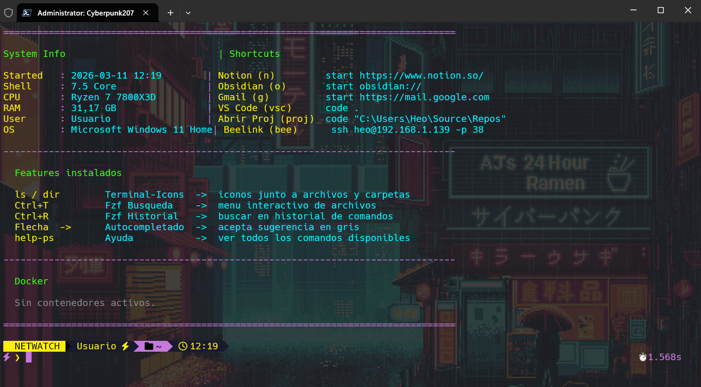

<div align="center">

<div align="center">
  
</div>

<pre>
██╗  ██╗███████╗ ██████╗    ██████╗ ███████╗██╗   ██╗
██║  ██║██╔════╝██╔═══██╗   ██╔══██╗██╔════╝██║   ██║
███████║█████╗  ██║   ██║   ██║  ██║█████╗  ██║   ██║
██╔══██║██╔══╝  ██║   ██║   ██║  ██║██╔══╝  ╚██╗ ██╔╝
██║  ██║███████╗╚██████╔╝   ██████╔╝███████╗ ╚████╔╝
╚═╝  ╚═╝╚══════╝ ╚═════╝    ╚═════╝ ╚══════╝  ╚═══╝
   M I   T E R M I N A L   C Y B E R P O W E R S H E L L
</pre>


**Cyberpunk-themed PowerShell environment + a built-in dojo to learn PowerShell, cmd and Linux**

*Dashboard · Oh My Posh NETWATCH theme · Dojo & Tatami (commands) · Forja & Santuario (scripting) · Spaced repetition*

**🌍 [English](#-english-version) · 🇪🇸 [Español](#-versión-en-español)**

</div>

---

## 📸 Preview

<div align="center">



</div>

---

## 🇪🇸 Versión en Español

### ✨ Qué incluye

**Entorno**

- **Dashboard al arranque** — info del sistema (con caché de 24 h), atajos, herramientas detectadas, estado de Docker y aviso de repaso pendiente
- **Tema Oh My Posh `NETWATCH`** — prompt con rama git, ruta, usuario y tiempo de ejecución
- **Paleta global** — cambia todo el tema editando 6 variables hex en `$global:CY`
- **`Write-Cyber`** — helper para escribir con cualquier color hex
- **zoxide** (`z`, `zi`), **fzf + PSFzf** (`Ctrl+T`, `Ctrl+R`), **Terminal-Icons** y **PSReadLine** con predicción del historial
- **`bee`** — SSH al Beelink leyendo host, usuario y puerto de `~/.ssh/config`, con comprobación de puerto antes de conectar
- **Funciones de administración** — `top-size`, `top-cpu`, `matar` (con confirmación), `puertos`, `clean-logs -WhatIf`
- **`help-ps`** y **`Measure-Profile`** — ayuda completa y medidor del tiempo de arranque

**Zona de entrenamiento** (para mejorar en PowerShell, cmd y Linux)

| Comando | Qué hace |
|---|---|
| `dojo` / `dojo2` | Preguntas sobre nombres de comandos (nivel 1) y comandos completos (nivel 2), en Linux, PowerShell y cmd |
| `rosetta` | Tabla de equivalencias Linux / PowerShell / cmd |
| `tatami` / `tatami2` | Misiones prácticas en una carpeta temporal: tú escribes el comando y se comprueba el resultado real |
| `forja` | Aprende a **escribir scripts de PowerShell**: 13 misiones con tests automáticos |
| `santuario` | Lo mismo en **bash**, lanzado desde PowerShell y ejecutado en **WSL2** (13 misiones) |
| `progreso` | Tu estado: dominados, pendientes de repaso y lo que más fallas |

Todo comparte un **sistema de repaso espaciado (Leitner)**: los fallos se guardan y vuelven a salir a los 0/1/3/7/21 días según la caja, con `-Repaso` para ver solo lo pendiente. Compatible con Windows PowerShell 5.1 y PowerShell 7.

---

### 🚀 Instalación

1. Instala las herramientas (una sola vez):

```powershell
winget install JanDeDobbeleer.OhMyPosh
winget install ajeetdsouza.zoxide
winget install junegunn.fzf
Install-Module Terminal-Icons -Scope CurrentUser
Install-Module PSFzf -Scope CurrentUser
oh-my-posh font install IBMPlexMono
```

2. En **Windows Terminal** (`Ctrl+,` → *Abrir archivo JSON*), dentro de `"profiles"` → `"defaults"` (y en tu perfil "Windows PowerShell" si tiene fuente propia), pon:

```json
"font": { "face": "Cascadia Mono, BlexMono Nerd Font" }
```

   Cascadia Mono pone las letras y **BlexMono Nerd Font** (la de Takuya, instalada en el paso 1) pone los iconos. Sin una Nerd Font no se ven los iconos: salen rombos `◆`. Si prefieres una sola fuente, usa `"face": "BlexMono Nerd Font"`. El fragmento listo para copiar está en `windows_terminal_fuente.jsonc`.
3. Clona el repo y copia el contenido en la carpeta de tu perfil (`Split-Path $PROFILE`), respetando la estructura de abajo:

```powershell
git clone https://github.com/HEO-80/powershell-cyberpunk.git
```

4. Si Windows bloquea los scripts descargados: `Get-ChildItem (Split-Path $PROFILE) -Recurse -Filter *.ps1 | Unblock-File`
5. Para `bee`, copia `ssh_config_beelink.txt` al final de `~\.ssh\config` (ajusta IP, usuario y puerto).
6. Para Santuario necesitas WSL con una distro de Linux: `wsl --install -d Ubuntu`. Comprueba con `santuario -Diagnostico`.
7. Abre una terminal nueva.

> Los `.ps1` deben ir en **UTF-8 con BOM** para que Windows PowerShell 5.1 lea bien las tildes.

---

### 🎨 Cambiar colores

Edita la paleta en `Cyberpunk2077/Cyberpunk2077.ps1`:

```powershell
$global:CY = @{
    Yellow  = "#FCEE0A"   # Acento principal — amarillo NETWATCH
    Green   = "#39FF14"   # Éxito / git limpio
    Cyan    = "#00F0FF"   # Info / valores
    Magenta = "#C678DD"   # Separadores / secundario
    Dark    = "#555555"   # Bordes
    Dim     = "#888888"   # Texto atenuado
}
```

El prompt se personaliza en `Cyberpunk2077/omp_cyberpunk.json`. El banner ASCII se apaga con `$global:ShowBanner = $false` en el perfil.

---

### 🥋 Cómo se entrena

```powershell
dojo -Modo Linux -Preguntas 5   # preguntas rápidas
tatami2                         # misión práctica
forja                           # escribe una función en PowerShell; Enter = probar
santuario                       # escribe una función en bash; se prueba en WSL
dojo -Repaso                    # solo lo que toca repasar hoy
progreso                        # tu estado
```

Forja y Santuario abren un archivo de plantilla en tu editor (VS Code si tienes `code`, si no el Bloc de notas, o el que definas en `$env:FORJA_EDITOR`). Escribes la solución, guardas y pulsas Enter: se ejecuta contra varios casos de prueba y te dice cuáles fallan. Dentro de una misión: `pista`, `ver`, `editar`, `plantilla`, `solucion`, `salir`.

| Caja | 1 | 2 | 3 | 4 | 5 |
|---|---|---|---|---|---|
| Vuelve a salir | próximo repaso | 1 día | 3 días | 7 días | 21 días |

---

### 🗂️ Estructura

```
Microsoft.PowerShell_profile.ps1   ← carga el tema Cyberpunk2077
ssh_config_beelink.txt             ← ejemplo de config SSH para `bee`
windows_terminal_fuente.jsonc      ← fuente de Windows Terminal (Cascadia + iconos)
Cyberpunk2077/
├── Cyberpunk2077.ps1              ← tema principal, dashboard, atajos y ayuda
├── omp_cyberpunk.json             ← tema Oh My Posh NETWATCH
├── Motor.ps1                      ← repaso espaciado + motores de dojo y tatami
├── Dojo.ps1 · Dojo2.ps1           ← preguntas nivel 1 y 2
├── Tatami1.ps1 · Tatami2.ps1      ← misiones prácticas nivel 1 y 2
├── Forja.ps1                      ← aprende a escribir scripts (PowerShell)
└── Santuario.ps1                  ← aprende a escribir scripts (bash en WSL)
```

Tu progreso se guarda en `%LOCALAPPDATA%\CyberProfile\` (fuera del repo).

---

### 🗺️ Roadmap

- [x] Dashboard con System Info + Docker status
- [x] Tema Oh My Posh NETWATCH
- [x] Paleta de colores configurable
- [x] zoxide, fzf y Terminal-Icons integrados
- [x] Dojo y Tatami (niveles 1 y 2)
- [x] Repaso espaciado de fallos
- [x] Forja: scripting en PowerShell
- [x] Santuario: scripting en bash vía WSL
- [ ] Instalador automático (`install.ps1`) actualizado a esta estructura
- [ ] Lista de "Features instalados" dinámica en el dashboard
- [ ] Nivel 3 de misiones (funciones avanzadas, módulos, Git)
- [ ] Tema para Linux/WSL (Fish + Bash)

---

### 🧑‍💻 Autor

**Héctor Oviedo** — Full Stack Dev & DeFi Researcher

[](https://www.linkedin.com/in/hectorob/)
[](https://github.com/HEO-80)
[](https://portfolio-cyberpunk-phi.vercel.app)

---
---

## 🇬🇧 English Version

### ✨ What's included

**Environment**

- **Startup dashboard** — system info (24 h cache), shortcuts, detected tools, Docker status and pending-review reminder
- **Oh My Posh `NETWATCH` theme** — prompt with git branch, path, user and execution time
- **Global palette** — change the whole theme by editing 6 hex variables in `$global:CY`
- **`Write-Cyber`** — helper to write any hex color
- **zoxide** (`z`, `zi`), **fzf + PSFzf** (`Ctrl+T`, `Ctrl+R`), **Terminal-Icons** and **PSReadLine** history prediction
- **`bee`** — SSH to the Beelink, reading host, user and port from `~/.ssh/config`, with a port check before connecting
- **Admin helpers** — `top-size`, `top-cpu`, `matar` (with confirmation), `puertos`, `clean-logs -WhatIf`
- **`help-ps`** and **`Measure-Profile`** — full help and startup timer

**Training area** (to get better at PowerShell, cmd and Linux)

| Command | What it does |
|---|---|
| `dojo` / `dojo2` | Quiz on command names (level 1) and full commands (level 2), for Linux, PowerShell and cmd |
| `rosetta` | Linux / PowerShell / cmd equivalence table |
| `tatami` / `tatami2` | Hands-on missions in a temp folder: you type the command and the real result is checked |
| `forja` | Learn to **write PowerShell scripts**: 13 missions with automatic tests |
| `santuario` | Same for **bash**, launched from PowerShell and run in **WSL2** (13 missions) |
| `progreso` | Your status: mastered, due for review, most failed |

Everything shares a **spaced-repetition (Leitner) system**: failures are saved and come back after 0/1/3/7/21 days depending on the box; use `-Repaso` to see only what's due. Works on Windows PowerShell 5.1 and PowerShell 7.

---

### 🚀 Install

1. Install the tools (once):

```powershell
winget install JanDeDobbeleer.OhMyPosh
winget install ajeetdsouza.zoxide
winget install junegunn.fzf
Install-Module Terminal-Icons -Scope CurrentUser
Install-Module PSFzf -Scope CurrentUser
oh-my-posh font install IBMPlexMono
```

2. In **Windows Terminal** (`Ctrl+,` → *Open JSON file*), inside `"profiles"` → `"defaults"` (and in your "Windows PowerShell" profile if it has its own font), set:

```json
"font": { "face": "Cascadia Mono, BlexMono Nerd Font" }
```

   Cascadia Mono draws the letters and **BlexMono Nerd Font** (Takuya's font, installed in step 1) draws the icons. Without a Nerd Font the icons show as `◆` boxes. For a single font, use `"face": "BlexMono Nerd Font"`. A ready-to-copy snippet is in `windows_terminal_fuente.jsonc`.
3. Clone the repo and copy its contents into your profile folder (`Split-Path $PROFILE`), keeping the structure below:

   **Perfil completo de Windows Terminal (el que uso en casa).** Si quieres el mismo aspecto, añade este perfil dentro de `"list"` en `settings.json` y cambia las rutas por las tuyas:

```json
   {
       "name": "Cyber PowerShell",
       "commandline": "%SystemRoot%\\System32\\WindowsPowerShell\\v1.0\\powershell.exe",
       "font": { "face": "Hack Nerd Font", "weight": "normal" },
       "colorScheme": "Dark+",
       "foreground": "#0DBC79",
       "cursorColor": "#E5E5E5",
       "backgroundImage": "C:\\Users\\TU_USUARIO\\Pictures\\Cyberpunk\\fondo.gif",
       "backgroundImageOpacity": 0.1,
       "adjustIndistinguishableColors": "indexed",
       "experimental.retroTerminalEffect": false,
       "elevate": true,
       "hidden": false
   }
```

   En `"profiles"` → `"defaults"` puedes añadir `"opacity": 50` y `"useAcrylic": true` para el efecto translúcido. La fuente `Hack Nerd Font` se instala con `oh-my-posh font install Hack`. Con `Cascadia Mono, BlexMono Nerd Font` (paso anterior) también funciona.
   
```powershell
git clone https://github.com/HEO-80/powershell-cyberpunk.git
```

4. If Windows blocks downloaded scripts: `Get-ChildItem (Split-Path $PROFILE) -Recurse -Filter *.ps1 | Unblock-File`
5. For `bee`, append `ssh_config_beelink.txt` to `~\.ssh\config` (adjust IP, user and port).
6. Santuario needs WSL with a Linux distro: `wsl --install -d Ubuntu`. Check with `santuario -Diagnostico`.
7. Open a new terminal.

> `.ps1` files must be saved as **UTF-8 with BOM** so Windows PowerShell 5.1 reads accents correctly.

---

### 🎨 Changing colors

Edit the palette in `Cyberpunk2077/Cyberpunk2077.ps1`:

```powershell
$global:CY = @{
    Yellow  = "#FCEE0A"   # Main accent — NETWATCH yellow
    Green   = "#39FF14"   # Success / clean git
    Cyan    = "#00F0FF"   # Info / values
    Magenta = "#C678DD"   # Separators / secondary
    Dark    = "#555555"   # Borders
    Dim     = "#888888"   # Muted text
}
```

The prompt lives in `Cyberpunk2077/omp_cyberpunk.json`. Turn the ASCII banner off with `$global:ShowBanner = $false` in the profile.

---

### 🥋 How to train

```powershell
dojo -Modo Linux -Preguntas 5   # quick questions
tatami2                         # hands-on mission
forja                           # write a PowerShell function; Enter = run tests
santuario                       # write a bash function; tested in WSL
dojo -Repaso                    # only what's due today
progreso                        # your status
```

Forja and Santuario open a template file in your editor (VS Code if `code` exists, otherwise Notepad, or whatever you set in `$env:FORJA_EDITOR`). Write the solution, save, press Enter: it runs against several test cases and shows which ones fail. Inside a mission: `pista` (hint), `ver`, `editar`, `plantilla`, `solucion`, `salir`.

| Box | 1 | 2 | 3 | 4 | 5 |
|---|---|---|---|---|---|
| Comes back | next review | 1 day | 3 days | 7 days | 21 days |

---

### 🗂️ Structure

```
Microsoft.PowerShell_profile.ps1   ← loads the Cyberpunk2077 theme
ssh_config_beelink.txt             ← sample SSH config for `bee`
windows_terminal_fuente.jsonc      ← Windows Terminal font (Cascadia + icons)
Cyberpunk2077/
├── Cyberpunk2077.ps1              ← main theme, dashboard, shortcuts and help
├── omp_cyberpunk.json             ← Oh My Posh NETWATCH theme
├── Motor.ps1                      ← spaced repetition + dojo/tatami engines
├── Dojo.ps1 · Dojo2.ps1           ← level 1 and 2 quizzes
├── Tatami1.ps1 · Tatami2.ps1      ← level 1 and 2 hands-on missions
├── Forja.ps1                      ← learn to write scripts (PowerShell)
└── Santuario.ps1                  ← learn to write scripts (bash in WSL)
```

Your progress is stored in `%LOCALAPPDATA%\CyberProfile\` (outside the repo).

---

### 🗺️ Roadmap

- [x] Dashboard with System Info + Docker status
- [x] Oh My Posh NETWATCH theme
- [x] Configurable palette
- [x] zoxide, fzf and Terminal-Icons integrated
- [x] Dojo and Tatami (levels 1 and 2)
- [x] Spaced repetition of failures
- [x] Forja: PowerShell scripting
- [x] Santuario: bash scripting via WSL
- [ ] Automatic installer (`install.ps1`) updated to this structure
- [ ] Dynamic "Installed features" list in the dashboard
- [ ] Level 3 missions (advanced functions, modules, Git)
- [ ] Linux/WSL theme (Fish + Bash)

---

### 🧑‍💻 Author

**Héctor Oviedo** — Full Stack Dev & DeFi Researcher

[](https://www.linkedin.com/in/hectorob/)
[](https://github.com/HEO-80)
[](https://portfolio-cyberpunk-phi.vercel.app)

---

<div align="center">
  <sub>⬡ NETWATCH OS v2.077 · Built for Windows Terminal · <strong>Héctor Oviedo</strong> · Zaragoza, España</sub>
</div>
